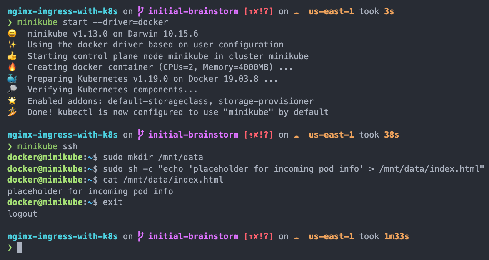
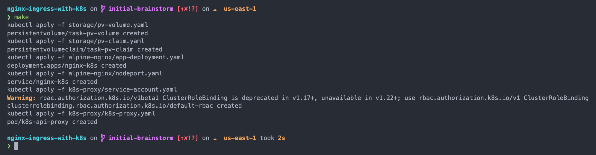
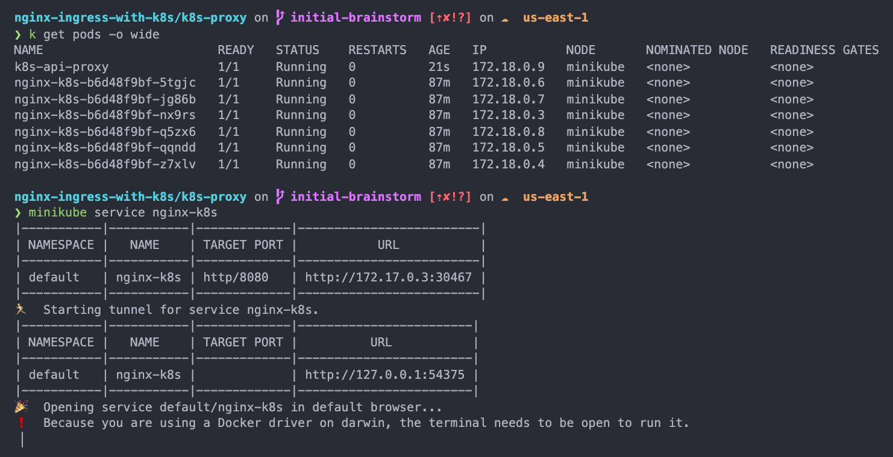
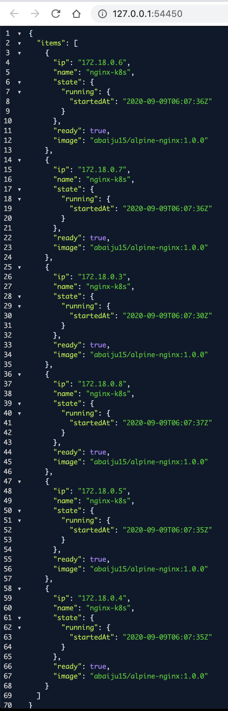

# nginx-ingress-with-k8s [on AWS]

The goal of this project was to construct a dynamic system that has a loadbalancer fronting any number of nginx containers. The main ask here was to be able to see a list of IP addresses of all the connected containers. Also, as containers are added or removed, we need to be able to quickly see the list at the loadbalancer endpoint change.

Specific requirements for the task:

- Each nginx instance needed to run in a separate docker container
- I couldn't use a pre-built nginx image, but had to start with an `alpine:3.10` base
- The solution needed to be highly available (this is still WIP)
- Easy to follow documentation must be included

Since this was a very open-ended excercise, I was free to pick & choose my tools. I went with a mix of both tools that I've worked with in the past and some new ones. This was quite challenging but in the end, I definitely learned quite a few new things working through it. My approach centered mostly around Kubernetes (this was mostly for better understanding & learning k8s purposes).

## Reference Material

- [Terraform Getting Started](https://www.terraform.io/intro/getting-started/install.html)
- [Terraform Docs](https://www.terraform.io/docs/index.html)

## Getting Started

Follow along to set up the solution in your local machine. I built it on a docker-based `minikube` on macOS.

### Prerequisites

Things you will need to install:

- [docker](https://docs.docker.com/get-docker/)
- [kubectl](https://kubernetes.io/docs/tasks/tools/install-kubectl/)
- [minikube](https://kubernetes.io/docs/tasks/tools/install-minikube/)
- [terraform](https://www.terraform.io/downloads.html) - (this is for when we will go to AWS)
- [aws cli](https://docs.aws.amazon.com/cli/latest/userguide/cli-chap-install.html) - (this is for when we will go to AWS)
- [make](https://osxdaily.com/2014/02/12/install-command-line-tools-mac-os-x/) - this is for running all the k8s commands in one go (optional)

## Steps (to run locally)

### Step 1: Clone this repo and change into the root location

- `git clone https://github.com/abaiju15/nginx-ingress-with-k8s`
- `cd nginx-ingress-with-k8s`

### Step 2: Build your docker images (optional if you want to use the ones I've created)

- Change into the `alpine-nginx` directory to create the nginx image first:

  ```sh
  ~ cd alpine-nginx
  > make # (ignore if no make)
  > docker build -f Dockerfile . -t <image_name>:<tag> --no-cache=true
  ```

- Now change into the `k8s-proxy` directory to create the k8s-proxy image - we will use this to spin up an ancillary pod that will be responsible for constantly pinging the k8s API to get info on all connected pods in the nginx deployment

  ```sh
  ~ cd ../k8s-proxy
  > make # (ignore if no make)
  > docker build -f Dockerfile . -t <image_name>:<tag> --no-cache=true
  ```
  
  > Note: instructions on [this tutorial](https://ropenscilabs.github.io/r-docker-tutorial/04-Dockerhub.html) can be followed to quickly push your images to Docker Hub

### Step 3: Start up minikube & setup path for volume

- The path `/mnt/data` is where we will mount a [__persistent volume__](https://kubernetes.io/docs/concepts/storage/persistent-volumes/) for sharing the static file to be served by all nginx pods

  ```sh
  > minikube start --driver=docker
  > minikube ssh
  > sudo mkdir /mnt/data
  > sudo sh -c "echo 'placeholder for incoming pod info' > /mnt/data/index.html"
  ```

  > 

### Step 4: Spin up the cluster & the supporting pod

- The options here are to either use `make` or run the commands in the `Makefile` manually

  ```sh
  > cd ..
  > make
  ```

  OR

  ```sh
  > cd ..
  > kubectl apply -f storage/pv-volume.yaml
  > kubectl apply -f storage/pv-claim.yaml
  > kubectl apply -f alpine-nginx/app-deployment.yaml
  > kubectl apply -f k8s-proxy/service-account.yaml
  > kubectl apply -f k8s-proxy/k8s-proxy.yaml
  ```

  > 

### Step 5: Visit the loadbalancer at the NodePort (todo: this will be a proper loadbalancer when in AWS)

- `minikube service nginx-k8s` - this will automatically start the service for you
  > 
  > 
